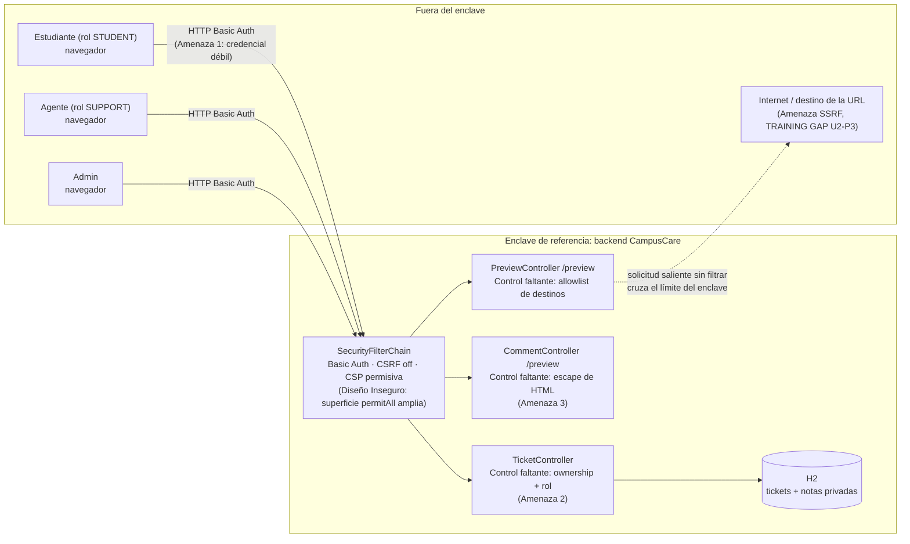

# Avance 1 — CampusCare: modelado de amenazas y diseño seguro

**Curso:** Ciberseguridad Aplicada · Unidad 1
**Equipo:** `Code Gazers` — integrantes: `Robert Stewart Teaze Legleu`, `Edgar Acevedo`, `Fernando Garces`
**Repositorio:** `https://github.com/RobertTSL/Campus-Care_CodeGazers.git`
**Commit analizado:** `9ec56b9`
**Pull Request revisado:** `https://github.com/RobertTSL/Campus-Care_CodeGazers/pull/1`

## 1. Amenazas (STRIDE)

### Amenaza 1 — Spoofing: identidad suplantable

- **Qué podría pasar:** los cuatro usuarios (`rivera`, `lopez`, `agente`, `admin`) comparten la misma contraseña (`demo123`) y las credenciales se validan con `NoOpPasswordEncoder`, es decir, en texto plano y sin costo computacional. Cualquiera que conozca o adivine un usuario puede autenticarse como él —incluido el rol `ADMIN`— sin necesitar la contraseña real de esa persona, ni límite de intentos ni segundo factor.
- **Evidencia:** `src/main/java/mx/edu/campuscare/config/SecurityConfig.java`, línea 5 (todas las cuentas con `.password("demo123")`) y línea 6 (`NoOpPasswordEncoder`).
- **Control propuesto:** reemplazar `NoOpPasswordEncoder` por `BCryptPasswordEncoder`, asignar una contraseña distinta por usuario, y agregar bloqueo/retardo tras intentos fallidos (`AuthenticationFailureHandler` con contador, o `spring-security` más un filtro de rate limiting). A mediano plazo, migrar de Basic Auth de laboratorio a un proveedor de identidad real.

### Amenaza 2 — Elevación de privilegios (EoP)  / IDOR: lectura y modificación de tickets ajenos

- **Qué podría pasar:** cualquier usuario autenticado —sin importar su rol— puede listar **todos** los tickets del sistema y leer o modificar el ticket de **otro** estudiante por su `id`, incluyendo tickets marcados `privateNote` (por ejemplo el de apoyo psicológico de `lopez`). El `PATCH` además acepta un `Map<String,Object>` genérico que permite cambiar el campo `owner`, reasignando el ticket a otra persona.
- **Evidencia:** `src/main/java/mx/edu/campuscare/tickets/TicketController.java` línea 7 (`GET /api/tickets` sin filtrar por dueño/rol), línea 8 (`GET /api/tickets/{id}` sin verificar propiedad — BOLA) y líneas 10–11 (`PATCH /api/tickets/{id}` con *binding* permisivo sobre `owner` y `privateNote`). La prueba `studentCannotReadAnotherUsersTicket` en `CampusCareApplicationTests.java` (línea 10) está deshabilitada explícitamente hasta corregir este gap, lo que confirma que es un riesgo conocido y no accidental.
- **Control propuesto:** aplicar control de acceso por propiedad y rol antes de tocar la entidad: filtrar `findAll()` por `owner == authentication.getName()` salvo rol `SUPPORT`/`ADMIN`, y validar en `one()`/`patch()` que el solicitante es dueño del ticket o tiene rol de soporte (`@PreAuthorize` o verificación explícita en el servicio). Sustituir el `Map<String,Object>` del `PATCH` por un DTO que sólo exponga los campos editables según el rol (por ejemplo un estudiante no debería poder cambiar `owner` ni `privateNote`).

### Amenaza 3 — Tampering: XSS reflejado en la vista previa de comentarios

- **Qué podría pasar:** el endpoint de vista previa concatena el parámetro `text` directamente dentro de HTML sin escapar, y está marcado `permitAll` (no requiere autenticación). Un atacante puede construir una URL con un `<script>` en `text` y compartirla, y si un agente o administrador la abre en una sesión donde el navegador ya guardó las credenciales de Basic Auth, el script corre en el origen de CampusCare y puede reenviar solicitudes autenticadas en su nombre.
- **Evidencia:** `src/main/java/mx/edu/campuscare/comments/CommentController.java` línea 4 (`"<article>...
"+text+"
</article>"`), la ruta está listada en `permitAll()` dentro de `SecurityConfig.java` en la línea 4. La prueba `xssTrainingGapIsReproducible` en `CampusCareApplicationTests.java` en la línea 9 reproduce el hallazgo.
- **Control propuesto:** dejar de construir HTML por concatenación de cadenas y usar una plantilla Thymeleaf (ya está en el `pom.xml`) con escape automático (`th:text`), o al menos codificar el texto con un *encoder* (como OWASP Java Encoder) antes de insertarlo. Complementar con una CSP más estricta que la actual.

## 2. Diagrama del sistema

Entre los actores externos y los datos hay una sola capa de control real (el `SecurityFilterChain`), y varias de sus reglas están deliberadamente abiertas: eso es el **Diseño Inseguro** que este avance documenta, no un objetivo a imitar. El backend y la base H2 forman el **enclave de referencia** del sistema —el perímetro donde vive la información sensible (tickets, notas privadas)—; hoy ese enclave confía implícitamente en cualquier cliente autenticado (`TicketController`) y en cualquier destino externo al que `PreviewController` decide conectarse, lo contrario de **Zero Trust**. La corrección no puede depender de un único control: necesita **defensa en profundidad** — autenticación más fuerte, autorización por objeto en cada controlador, salida codificada y una lista de salida controlada — de modo que si un control falla, el siguiente contenga el daño.

## 3. Decisiones de diseño

### Decisión 1 — Autorización por propiedad y rol en `TicketController` (defensa en profundidad)

- **Solución elegida:** mover la verificación de acceso fuera del controlador hacia una capa de servicio que, para cada operación, comprueba `owner == usuario_actual` o rol `SUPPORT`/`ADMIN`, y usa un DTO específico por rol en el `PATCH` en vez del `Map` genérico. Esto añade una segunda capa de control (autorización por objeto) además de la autenticación que ya existe, siguiendo defensa en profundidad.
- **Alternativa considerada:** *row-level security* a nivel de base de datos (H2/vista filtrada por usuario). Se descartó para este avance porque acopla la regla de negocio al motor de base de datos, es más difícil de probar con `MockMvc` y H2 tiene soporte limitado de RLS comparado con Postgres.
- **Riesgo que permanece abierto:** si en el futuro se agregan más roles o se reutiliza `SUPPORT` para otros fines, la regla "propietario o soporte" puede quedar demasiado amplia; falta además registro de auditoría (quién leyó/modificó qué ticket) para detectar abuso del rol de soporte.

### Decisión 2 — Tratar las llamadas salientes de `PreviewController` como tráfico no confiable (Zero Trust hacia el enclave)

- **Solución elegida:** exigir que toda solicitud saliente del `PreviewController` pase por una validación explícita antes de conectarse: allowlist de esquemas/dominios permitidos y bloqueo de rangos de IP privados/loopback/metadata (`127.0.0.0/8`, `169.254.169.254`, `10.0.0.0/8`, etc.), re-resolviendo el DNS justo antes de conectar. Es la aplicación de Zero Trust al límite del enclave: el hecho de que la solicitud venga de un usuario autenticado no la hace confiable si su destino es arbitrario.
- **Alternativa considerada:** confiar únicamente en la CSP del navegador o en un firewall de salida a nivel de red. Se descartó como control único porque no evita que el propio backend (dentro del enclave, con confianza total de red) ejecute la solicitud SSRF; la CSP protege al navegador, no al servidor.
- **Riesgo que permanece abierto:** mantener la allowlist actualizada tiene costo operativo, y un atacante podría intentar *DNS rebinding* (el dominio resuelve a una IP pública en el momento de validar y a una privada al conectar) si no se re-valida la IP en el momento exacto de la conexión.

## 4. Pruebas propuestas y seguimiento

| Amenaza | Prueba propuesta | Resultado esperado tras el control | Se implementará en | Responsable |
|---|---|---|---|---|
| 1. Spoofing (credenciales) | Test de integración: login con la contraseña de otro usuario del mismo tipo (p. ej. probar `demo123` genérico contra una cuenta con contraseña ya rotada) y prueba de fuerza bruta simulada (N intentos fallidos seguidos) | `401 Unauthorized` para credenciales incorrectas y bloqueo/retardo tras N intentos, en vez de aceptación silenciosa | Avance/Unidad 2 | `<NOMBRE>` |
| 2. IDOR/BOLA en tickets | Habilitar y pasar `studentCannotReadAnotherUsersTicket` (`GET /api/tickets/2` con credenciales de `rivera`) y agregar caso equivalente para `PATCH` intentando cambiar `owner` | `403 Forbidden` en ambos casos; `agente`/`admin` sí pueden acceder | Avance/Unidad 3 (ya referenciado en el propio starter) | `<NOMBRE>` |
| 3. XSS reflejado en preview | Repetir `xssTrainingGapIsReproducible` pero afirmando que la respuesta **no** contiene `<script>` sin escapar, sino la entidad HTML codificada | El `<script>` aparece codificado (`&lt;script&gt;`) y no se ejecuta en el navegador | Avance/Unidad 2 | `<NOMBRE>` |

**Declaración de uso de IA:** este avance se elaboró con apoyo de un asistente de IA para redactar el análisis STRIDE y el diagrama a partir del código real del starter (`SecurityConfig.java`, `TicketController.java`, `CommentController.java`, `PreviewController.java`, `CampusCareApplicationTests.java`). El equipo verificó cada hallazgo ejecutando `./mvnw test` sobre el baseline y revisando manualmente las líneas citadas antes de aceptarlas. Los datos del equipo, el PR y el commit fueron completados por las personas que integran el equipo.
